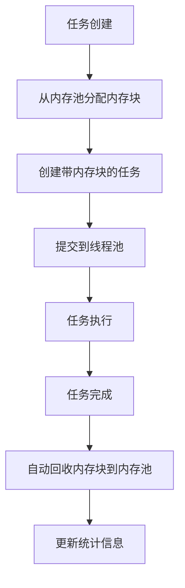

# CANP - 分层批量并发流水线

一个高性能的分层批量并发流水线系统，专为大规模数据处理设计。

## 🏗️ 系统架构

### 核心组件

1. **内存池 (Memory Pool)** - 高效的内存管理
2. **线程池 (Thread Pool)** - 智能的任务调度
3. **流水线 (Pipeline)** - 分层批量处理

## 🧠 内存池 (Memory Pool)

### 设计理念

内存池采用**分层设计**和**零拷贝**原则，提供高效的内存管理：

- **分层内存池**：根据数据大小分层管理
- **内存复用**：避免频繁分配/释放
- **零拷贝访问**：直接指针访问，无数据拷贝
- **统计监控**：实时内存使用情况

### 核心结构

#### MemoryBlock - 智能内存块

```rust
pub struct MemoryBlock {
    data: Arc<Vec<u8>>,      // 数据指针（共享所有权）
    length: usize,           // 数据长度
    created_at: Instant,     // 创建时间
}
```

**特性**：
- ✅ **零拷贝访问**：`as_slice()`, `as_ptr_and_len()`
- ✅ **智能管理**：自动引用计数
- ✅ **不可克隆**：避免意外数据拷贝

#### UnifiedMemoryPool - 统一内存池

```rust
pub struct UnifiedMemoryPool {
    // 分层内存池
    block_pools: Vec<Arc<LockPool<Vec<u8>, 64, 1024>>>,      // 通用内存块池
    decompress_pools: Vec<Arc<LockPool<Vec<u8>, 32, 256>>>,  // 解压缩缓冲区池
    frame_pools: Vec<Arc<LockPool<Vec<u8>, 64, 512>>>,       // 帧数据缓冲区池
    
    // 缓存系统
    mmap_cache: Arc<RwLock<LruCache<String, Arc<MmapBlock>>>>,
    block_cache: Arc<RwLock<LruCache<String, Arc<MemoryBlock>>>>,
    
    // 统计和监控
    stats: Arc<RwLock<MemoryPoolStats>>,
    current_memory_usage: Arc<RwLock<usize>>,
}
```

### 内存池配置

```rust
pub struct MemoryPoolConfig {
    // 分层大小配置
    pub block_sizes: Vec<usize>,        // [512, 1024, 2048, 4096, 8192]
    pub decompress_sizes: Vec<usize>,   // [1024, 2048, 4096, 8192, 16384]
    pub frame_sizes: Vec<usize>,        // [256, 512, 1024, 2048, 4096]
    
    // 缓存配置
    pub mmap_cache_size: usize,         // 1000
    pub block_cache_size: usize,        // 500
    pub cache_ttl: u64,                 // 300秒
    
    // 内存限制
    pub max_total_memory: usize,        // 1GB
    pub memory_warning_threshold: f64,  // 0.8 (80%)
}
```

### 使用示例

#### 基本内存分配

```rust
let pool = UnifiedMemoryPool::default();

// 分配内存块
let block = pool.allocate_block(1024)?;
assert_eq!(block.len(), 0);  // 新分配的长度为0
assert!(block.is_empty());

// 零拷贝访问
let slice = block.as_slice();
let (ptr, len) = block.as_ptr_and_len();

// 回收内存
pool.release_block(block)?;
```

#### 批量内存分配

```rust
// 批量分配
let sizes = vec![1024, 2048, 4096];
let blocks = pool.allocate_blocks_batch(&sizes)?;

// 批量回收
pool.release_blocks_batch(blocks)?;
```

#### 异步内存分配

```rust
// 异步分配
let block = pool.allocate_block_async(1024).await?;

// 异步批量分配
let blocks = pool.allocate_blocks_batch_async(&sizes).await?;
```

#### 内存统计监控

```rust
let stats = pool.get_stats();
println!("总分配次数: {}", stats.total_allocations);
println!("总释放次数: {}", stats.total_deallocations);
println!("当前内存使用: {} bytes", stats.current_memory_usage);
println!("峰值内存使用: {} bytes", stats.peak_memory_usage);
println!("池命中率: {:.2}%", stats.block_pool_hit_rate * 100.0);
```

## ⚡ 线程池 (Thread Pool)

### 设计理念

线程池采用**任务类型分类**和**高性能库集成**：

- **任务分类**：IO密集型、CPU密集型、内存密集型
- **库集成**：tokio (IO)、rayon (CPU)、threadpool (内存)
- **内存集成**：与内存池深度协作
- **统计监控**：实时任务执行情况

### 核心结构

#### Task - 任务定义

```rust
pub struct Task {
    pub id: u64,                                    // 任务ID
    pub task_type: TaskType,                        // 任务类型
    pub priority: TaskPriority,                     // 任务优先级
    pub payload: Box<dyn FnOnce() -> Result<()> + Send + 'static>,  // 任务逻辑
    pub created_at: Instant,                        // 创建时间
    pub memory_blocks: Vec<MemoryBlock>,            // 关联的内存块
}
```

#### TaskType - 任务类型

```rust
pub enum TaskType {
    IoBound,      // IO密集型：文件读取、mmap
    CpuBound,     // CPU密集型：解析、解压
    MemoryBound,  // 内存密集型：数据处理
}
```

#### TaskPriority - 任务优先级

```rust
pub enum TaskPriority {
    Low = 0,      // 低优先级
    Normal = 1,   // 普通优先级
    High = 2,     // 高优先级
    Critical = 3, // 关键优先级
}
```

#### PipelineThreadPool - 流水线线程池

```rust
pub struct PipelineThreadPool {
    // 专用线程池
    io_bound_runtime: Arc<Runtime>,           // tokio runtime (IO)
    cpu_bound_pool: Arc<rayon::ThreadPool>,   // rayon pool (CPU)
    memory_bound_pool: Arc<StdThreadPool>,    // threadpool (内存)
    
    // 内存池集成
    memory_pool: Arc<UnifiedMemoryPool>,
    
    // 统计信息
    stats: Arc<Mutex<ThreadPoolStats>>,
}
```

### 线程池配置

```rust
pub struct ThreadPoolConfig {
    pub io_bound_threads: usize,        // CPU核心数 / 2
    pub cpu_bound_threads: usize,       // CPU核心数
    pub memory_bound_threads: usize,    // CPU核心数 / 2
    pub enable_stats: bool,             // true
    pub enable_memory_management: bool, // true
}
```

### 使用示例

#### 基本任务提交

```rust
let pool = PipelineThreadPool::default();

// IO密集型任务
pool.submit_io_task(TaskPriority::Normal, || {
    // 文件读取、网络IO等
    Ok(())
})?;

// CPU密集型任务
pool.submit_cpu_task(TaskPriority::High, || {
    // 数据解析、压缩解压等
    Ok(())
})?;

// 内存密集型任务
pool.submit_memory_task(TaskPriority::Normal, || {
    // 大量数据处理
    Ok(())
})?;
```

#### 带内存块的任务

```rust
// 分配内存块
let memory_blocks = vec![
    pool.memory_pool().allocate_block(1024)?,
    pool.memory_pool().allocate_block(2048)?,
];

// 提交带内存块的任务
pool.submit_task_with_memory(
    TaskType::MemoryBound,
    TaskPriority::Normal,
    memory_blocks,
    || {
        // 使用分配的内存块处理数据
        Ok(())
    }
)?;
```

#### 批量任务提交

```rust
let mut tasks = Vec::new();

for i in 0..10 {
    let memory_blocks = vec![
        pool.memory_pool().allocate_block(512)?,
    ];
    
    let task = Task::with_memory(
        TaskType::CpuBound,
        TaskPriority::Normal,
        memory_blocks,
        move || {
            println!("处理任务 {}", i);
            Ok(())
        }
    );
    tasks.push(task);
}

// 批量提交
pool.submit_batch(tasks)?;
```

#### 并行数据处理

```rust
let data = vec![1, 2, 3, 4, 5, 6, 7, 8, 9, 10];

let results = pool.parallel_process(data, |x| {
    // 并行处理每个元素
    Ok(x * 2)
})?;

assert_eq!(results, vec![2, 4, 6, 8, 10, 12, 14, 16, 18, 20]);
```

#### 统计监控

```rust
let stats = pool.get_stats();
println!("总任务数: {}", stats.total_tasks);
println!("已完成任务: {}", stats.completed_tasks);
println!("失败任务: {}", stats.failed_tasks);
println!("平均执行时间: {:.2}ms", stats.avg_execution_time);

// 内存管理统计
let mem_stats = &stats.memory_management_stats;
println!("总内存块数: {}", mem_stats.total_memory_blocks);
println!("已回收内存块: {}", mem_stats.recycled_memory_blocks);
println!("内存复用率: {:.2}%", mem_stats.memory_reuse_rate * 100.0);
```

## 🔗 内存池与线程池协作

### 协作机制

内存池和线程池通过**深度集成**实现高效协作：

1. **内存生命周期管理**：线程池控制内存的分配、使用、回收
2. **零拷贝数据传递**：内存块在任务间传递时不复制数据
3. **自动内存回收**：任务完成后自动回收关联的内存块
4. **统计信息同步**：内存使用情况实时同步

### 协作流程



### 协作示例

#### 完整的数据处理流程

```rust
use canp::{PipelineThreadPool, TaskType, TaskPriority};

async fn process_data_pipeline() -> Result<()> {
    let pool = PipelineThreadPool::default();
    
    // 阶段1: 文件读取 (IO密集型)
    let file_blocks = vec![
        pool.memory_pool().allocate_block(1024 * 1024)?,  // 1MB
    ];
    
    pool.submit_task_with_memory(
        TaskType::IoBound,
        TaskPriority::High,
        file_blocks,
        || {
            // 读取文件到内存块
            println!("读取文件数据");
            Ok(())
        }
    )?;
    
    // 阶段2: 数据解析 (CPU密集型)
    let parse_blocks = vec![
        pool.memory_pool().allocate_block(512 * 1024)?,   // 512KB
        pool.memory_pool().allocate_block(256 * 1024)?,   // 256KB
    ];
    
    pool.submit_task_with_memory(
        TaskType::CpuBound,
        TaskPriority::Normal,
        parse_blocks,
        || {
            // 解析数据
            println!("解析数据");
            Ok(())
        }
    )?;
    
    // 阶段3: 数据处理 (内存密集型)
    let process_blocks = vec![
        pool.memory_pool().allocate_block(1024 * 1024)?,  // 1MB
        pool.memory_pool().allocate_block(1024 * 1024)?,  // 1MB
    ];
    
    pool.submit_task_with_memory(
        TaskType::MemoryBound,
        TaskPriority::Normal,
        process_blocks,
        || {
            // 处理数据
            println!("处理数据");
            Ok(())
        }
    )?;
    
    // 等待所有任务完成
    pool.wait_for_completion();
    
    // 查看最终统计
    let stats = pool.get_stats();
    let mem_stats = pool.memory_pool().get_stats();
    
    println!("=== 执行统计 ===");
    println!("完成任务: {}/{}", stats.completed_tasks, stats.total_tasks);
    println!("内存复用率: {:.2}%", stats.memory_management_stats.memory_reuse_rate * 100.0);
    println!("峰值内存使用: {} MB", mem_stats.peak_memory_usage / 1024 / 1024);
    
    Ok(())
}
```

#### 批量数据处理

```rust
async fn batch_data_processing() -> Result<()> {
    let pool = PipelineThreadPool::default();
    
    // 创建批量任务
    let mut batch_tasks = Vec::new();
    
    for batch_id in 0..5 {
        // 为每个批次分配内存
        let memory_blocks = vec![
            pool.memory_pool().allocate_block(1024 * 1024)?,  // 1MB
            pool.memory_pool().allocate_block(512 * 1024)?,   // 512KB
        ];
        
        let task = Task::with_memory(
            TaskType::CpuBound,
            TaskPriority::Normal,
            memory_blocks,
            move || {
                println!("处理批次 {}", batch_id);
                // 模拟数据处理
                std::thread::sleep(std::time::Duration::from_millis(100));
                Ok(())
            }
        );
        
        batch_tasks.push(task);
    }
    
    // 批量提交任务
    pool.submit_batch(batch_tasks)?;
    
    // 等待完成
    pool.wait_for_completion();
    
    Ok(())
}
```

#### 内存池统计监控

```rust
fn monitor_memory_usage(pool: &PipelineThreadPool) {
    let mem_stats = pool.memory_pool().get_stats();
    let thread_stats = pool.get_stats();
    
    println!("=== 内存池统计 ===");
    println!("总分配次数: {}", mem_stats.total_allocations);
    println!("总释放次数: {}", mem_stats.total_deallocations);
    println!("当前内存使用: {} MB", mem_stats.current_memory_usage / 1024 / 1024);
    println!("峰值内存使用: {} MB", mem_stats.peak_memory_usage / 1024 / 1024);
    println!("池命中率: {:.2}%", mem_stats.block_pool_hit_rate * 100.0);
    
    println!("=== 线程池统计 ===");
    println!("总任务数: {}", thread_stats.total_tasks);
    println!("完成任务: {}", thread_stats.completed_tasks);
    println!("失败任务: {}", thread_stats.failed_tasks);
    println!("平均执行时间: {:.2}ms", thread_stats.avg_execution_time);
    
    println!("=== 内存管理统计 ===");
    let mem_mgmt = &thread_stats.memory_management_stats;
    println!("总内存块数: {}", mem_mgmt.total_memory_blocks);
    println!("已回收内存块: {}", mem_mgmt.recycled_memory_blocks);
    println!("内存复用率: {:.2}%", mem_mgmt.memory_reuse_rate * 100.0);
}
```

### 协作优势

1. **内存生命周期可控**
   - 内存分配由内存池管理
   - 内存回收由线程池触发
   - 避免内存泄漏

2. **高效内存复用**
   - 内存块在任务间复用
   - 减少内存分配开销
   - 提高缓存命中率

3. **零拷贝数据访问**
   - 直接指针访问
   - 避免数据拷贝
   - 提高性能

4. **完善的错误处理**
   - 内存分配失败处理
   - 内存回收失败处理
   - 批量操作原子性

5. **实时统计监控**
   - 内存使用情况
   - 任务执行情况
   - 性能指标监控

## 🚀 性能特性

### 内存池性能

- **分层设计**：根据数据大小优化分配
- **内存复用**：减少分配/释放开销
- **零拷贝**：直接指针访问
- **缓存优化**：LRU缓存机制

### 线程池性能

- **任务分类**：根据任务类型选择最优线程池
- **库集成**：使用高性能的tokio、rayon、threadpool
- **内存集成**：与内存池深度协作
- **批量处理**：支持批量任务提交

### 协作性能

- **内存生命周期管理**：自动内存回收
- **统计信息同步**：实时性能监控
- **错误处理**：完善的错误恢复机制

## 📊 使用建议

### 内存池使用

1. **选择合适的分配方法**
   - 单次分配：`allocate_block()`
   - 批量分配：`allocate_blocks_batch()`
   - 异步分配：`allocate_block_async()`

2. **合理设置内存限制**
   - 根据系统内存设置`max_total_memory`
   - 设置合适的警告阈值
   - 监控内存使用情况

3. **利用缓存机制**
   - 设置合适的缓存大小
   - 配置缓存TTL
   - 定期清理过期缓存

### 线程池使用

1. **正确选择任务类型**
   - IO密集型：文件读取、网络IO
   - CPU密集型：数据解析、压缩解压
   - 内存密集型：大量数据处理

2. **合理设置线程数**
   - IO密集型：CPU核心数 / 2
   - CPU密集型：CPU核心数
   - 内存密集型：CPU核心数 / 2

3. **使用批量处理**
   - 批量提交任务
   - 并行处理数据
   - 减少任务调度开销

### 协作使用

1. **内存生命周期管理**
   - 任务开始时分配内存
   - 任务执行期间使用内存
   - 任务完成后自动回收

2. **统计监控**
   - 实时监控内存使用
   - 跟踪任务执行情况
   - 分析性能瓶颈

3. **错误处理**
   - 处理内存分配失败
   - 处理内存回收失败
   - 实现错误恢复机制

## 🔧 配置示例

### 高性能配置

```rust
let config = MemoryPoolConfig {
    block_sizes: vec![512, 1024, 2048, 4096, 8192, 16384],
    decompress_sizes: vec![1024, 2048, 4096, 8192, 16384, 32768],
    frame_sizes: vec![256, 512, 1024, 2048, 4096, 8192],
    mmap_cache_size: 2000,
    block_cache_size: 1000,
    cache_ttl: 600,
    max_total_memory: 2 * 1024 * 1024 * 1024,  // 2GB
    memory_warning_threshold: 0.85,
    ..Default::default()
};

let thread_config = ThreadPoolConfig {
    io_bound_threads: num_cpus::get() / 2,
    cpu_bound_threads: num_cpus::get(),
    memory_bound_threads: num_cpus::get() / 2,
    enable_stats: true,
    enable_memory_management: true,
};
```

### 内存受限配置

```rust
let config = MemoryPoolConfig {
    block_sizes: vec![256, 512, 1024, 2048],
    decompress_sizes: vec![512, 1024, 2048, 4096],
    frame_sizes: vec![128, 256, 512, 1024],
    mmap_cache_size: 100,
    block_cache_size: 50,
    cache_ttl: 300,
    max_total_memory: 512 * 1024 * 1024,  // 512MB
    memory_warning_threshold: 0.7,
    ..Default::default()
};
```

这个系统为**分层批量并发流水线**提供了坚实的内存管理和任务调度基础！ 